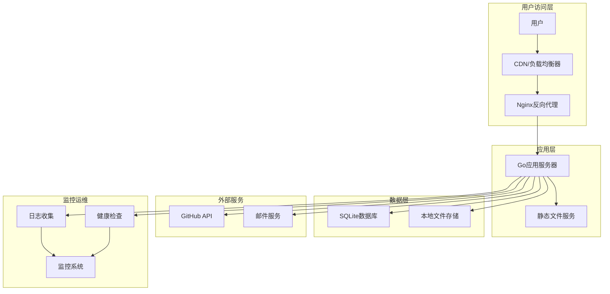

# 博客管理系统技术方案设计

## 1. 架构概述

### 1.1 整体设计思路
采用**分层架构**和**模块化设计**，确保系统的可维护性和扩展性。借鉴HALO系统的插件化设计理念，但采用更轻量级的实现方式。

### 1.2 架构分层
```
┌─────────────────────────────────────────┐
│           表现层 (Presentation Layer)        │
│  Web UI + RESTful API + Static Assets    │
├─────────────────────────────────────────┤
│           业务逻辑层 (Business Layer)        │
│   Service + Domain Model + Use Cases     │
├─────────────────────────────────────────┤
│           数据访问层 (Data Access Layer)      │
│   Repository Pattern + SQLite ORM        │
├─────────────────────────────────────────┤
│           基础设施层 (Infrastructure Layer)   │
│   Config + Logger + Cache + Storage     │
└─────────────────────────────────────────┘
```

### 1.3 技术栈选择
- **后端框架**: Go 1.21+ + Gin Web Framework
- **数据库**: SQLite 3.40+ (轻量级，符合内存限制)
- **ORM**: GORM v2 (简化数据库操作)
- **缓存**: 内存缓存 (sync.Map) + 可选Redis扩展
- **认证**: JWT + OAuth 2.0兼容设计
- **文件存储**: 本地文件系统 + 可扩展云存储
- **配置管理**: Viper
- **日志**: Logrus
- **API文档**: Swagger/OpenAPI 3.0
- **部署**: Docker + GitHub Actions

## 2. 模块/组件划分

### 2.1 核心模块结构
```
blog-system/
├── cmd/                    # 应用入口
│   └── server/
│       └── main.go
├── internal/               # 内部包
│   ├── api/               # API层
│   │   ├── handlers/      # HTTP处理器
│   │   ├── middleware/    # 中间件
│   │   └── routes/        # 路由定义
│   ├── auth/              # 认证模块
│   │   ├── jwt/           # JWT处理
│   │   ├── oauth/         # OAuth提供者接口
│   │   └── providers/     # 具体登录提供者
│   ├── blog/              # 博客模块
│   │   ├── service/       # 业务逻辑
│   │   ├── repository/    # 数据访问
│   │   └── model/         # 数据模型
│   ├── moment/            # 随念模块
│   │   ├── service/
│   │   ├── repository/
│   │   └── model/
│   ├── user/              # 用户模块
│   │   ├── service/
│   │   ├── repository/
│   │   └── model/
│   ├── media/             # 图床模块
│   │   ├── service/
│   │   ├── storage/
│   │   └── model/
│   ├── sync/              # 同步模块
│   │   ├── github/
│   │   └── service/
│   ├── admin/             # 管理后台
│   │   └── service/
│   └── core/              # 核心组件
│       ├── config/        # 配置管理
│       ├── database/      # 数据库连接
│       ├── cache/         # 缓存
│       ├── logger/        # 日志
│       └── utils/         # 工具函数
├── pkg/                   # 公共包
│   ├── response/          # 响应格式
│   ├── validator/         # 验证器
│   └── pagination/        # 分页
├── migrations/            # 数据库迁移
├── static/                # 静态文件
├── templates/             # 模板文件
├── configs/               # 配置文件
└── docs/                  # 文档
```

### 2.2 模块依赖关系
```
api -> auth -> user
api -> blog -> user
api -> moment -> user
api -> media -> user
api -> sync -> blog, moment
admin -> blog, moment, user
core -> 所有模块
```

## 3. 数据库设计

### 3.1 核心数据表

#### 用户相关表
```sql
-- 用户主表
CREATE TABLE users (
    id INTEGER PRIMARY KEY AUTOINCREMENT,
    username VARCHAR(50) UNIQUE NOT NULL,
    email VARCHAR(100) UNIQUE,
    phone VARCHAR(20) UNIQUE,
    nickname VARCHAR(50),
    avatar VARCHAR(255),
    password_hash VARCHAR(255),
    role ENUM('admin', 'user') DEFAULT 'user',
    status ENUM('active', 'inactive', 'banned') DEFAULT 'active',
    created_at DATETIME DEFAULT CURRENT_TIMESTAMP,
    updated_at DATETIME DEFAULT CURRENT_TIMESTAMP
);

-- 用户认证方式绑定表
CREATE TABLE user_auth_providers (
    id INTEGER PRIMARY KEY AUTOINCREMENT,
    user_id INTEGER NOT NULL,
    provider VARCHAR(50) NOT NULL, -- 'email', 'github', 'wechat', 'google', 'phone'
    provider_id VARCHAR(100), -- 第三方平台的用户ID
    provider_data JSON, -- 第三方返回的原始数据
    is_primary BOOLEAN DEFAULT FALSE,
    created_at DATETIME DEFAULT CURRENT_TIMESTAMP,
    FOREIGN KEY (user_id) REFERENCES users(id) ON DELETE CASCADE,
    UNIQUE(provider, provider_id)
);
```

#### 内容相关表
```sql
-- 分类表
CREATE TABLE categories (
    id INTEGER PRIMARY KEY AUTOINCREMENT,
    name VARCHAR(50) NOT NULL,
    slug VARCHAR(50) UNIQUE NOT NULL,
    description TEXT,
    created_at DATETIME DEFAULT CURRENT_TIMESTAMP
);

-- 标签表
CREATE TABLE tags (
    id INTEGER PRIMARY KEY AUTOINCREMENT,
    name VARCHAR(30) NOT NULL,
    slug VARCHAR(30) UNIQUE NOT NULL,
    created_at DATETIME DEFAULT CURRENT_TIMESTAMP
);

-- 文章/随念主表
CREATE TABLE posts (
    id INTEGER PRIMARY KEY AUTOINCREMENT,
    title VARCHAR(200),
    slug VARCHAR(200) UNIQUE,
    content TEXT NOT NULL,
    excerpt TEXT,
    type ENUM('blog', 'moment') NOT NULL,
    status ENUM('published', 'draft', 'private') DEFAULT 'draft',
    author_id INTEGER NOT NULL,
    category_id INTEGER,
    featured_image VARCHAR(255),
    view_count INTEGER DEFAULT 0,
    like_count INTEGER DEFAULT 0,
    comment_count INTEGER DEFAULT 0,
    is_top BOOLEAN DEFAULT FALSE,
    published_at DATETIME,
    created_at DATETIME DEFAULT CURRENT_TIMESTAMP,
    updated_at DATETIME DEFAULT CURRENT_TIMESTAMP,
    FOREIGN KEY (author_id) REFERENCES users(id),
    FOREIGN KEY (category_id) REFERENCES categories(id)
);

-- 文章标签关联表
CREATE TABLE post_tags (
    post_id INTEGER NOT NULL,
    tag_id INTEGER NOT NULL,
    PRIMARY KEY (post_id, tag_id),
    FOREIGN KEY (post_id) REFERENCES posts(id) ON DELETE CASCADE,
    FOREIGN KEY (tag_id) REFERENCES tags(id) ON DELETE CASCADE
);
```

#### 互动相关表
```sql
-- 评论表
CREATE TABLE comments (
    id INTEGER PRIMARY KEY AUTOINCREMENT,
    post_id INTEGER NOT NULL,
    author_id INTEGER,
    parent_id INTEGER, -- 支持嵌套评论
    content TEXT NOT NULL,
    author_name VARCHAR(50), -- 游客评论时的昵称
    author_email VARCHAR(100), -- 游客评论时的邮箱
    author_ip VARCHAR(45), -- IP地址
    status ENUM('approved', 'pending', 'spam', 'trash') DEFAULT 'pending',
    like_count INTEGER DEFAULT 0,
    created_at DATETIME DEFAULT CURRENT_TIMESTAMP,
    FOREIGN KEY (post_id) REFERENCES posts(id) ON DELETE CASCADE,
    FOREIGN KEY (author_id) REFERENCES users(id),
    FOREIGN KEY (parent_id) REFERENCES comments(id) ON DELETE CASCADE
);

-- 点赞表
CREATE TABLE likes (
    id INTEGER PRIMARY KEY AUTOINCREMENT,
    user_id INTEGER NOT NULL,
    target_type ENUM('post', 'comment') NOT NULL,
    target_id INTEGER NOT NULL,
    created_at DATETIME DEFAULT CURRENT_TIMESTAMP,
    FOREIGN KEY (user_id) REFERENCES users(id) ON DELETE CASCADE,
    UNIQUE(user_id, target_type, target_id)
);

-- 收藏表
CREATE TABLE favorites (
    id INTEGER PRIMARY KEY AUTOINCREMENT,
    user_id INTEGER NOT NULL,
    post_id INTEGER NOT NULL,
    created_at DATETIME DEFAULT CURRENT_TIMESTAMP,
    FOREIGN KEY (user_id) REFERENCES users(id) ON DELETE CASCADE,
    FOREIGN KEY (post_id) REFERENCES posts(id) ON DELETE CASCADE,
    UNIQUE(user_id, post_id)
);
```

#### 系统相关表
```sql
-- 系统配置表
CREATE TABLE system_configs (
    key VARCHAR(100) PRIMARY KEY,
    value TEXT,
    type VARCHAR(20) DEFAULT 'string', -- string, number, boolean, json
    description TEXT,
    updated_at DATETIME DEFAULT CURRENT_TIMESTAMP
);

-- 媒体文件表
CREATE TABLE media_files (
    id INTEGER PRIMARY KEY AUTOINCREMENT,
    filename VARCHAR(255) NOT NULL,
    original_name VARCHAR(255) NOT NULL,
    mime_type VARCHAR(100) NOT NULL,
    size INTEGER NOT NULL,
    path VARCHAR(500) NOT NULL,
    url VARCHAR(500),
    uploader_id INTEGER,
    created_at DATETIME DEFAULT CURRENT_TIMESTAMP,
    FOREIGN KEY (uploader_id) REFERENCES users(id)
);

-- 系统日志表
CREATE TABLE system_logs (
    id INTEGER PRIMARY KEY AUTOINCREMENT,
    level ENUM('debug', 'info', 'warn', 'error') NOT NULL,
    message TEXT NOT NULL,
    context JSON,
    user_id INTEGER,
    ip VARCHAR(45),
    user_agent TEXT,
    created_at DATETIME DEFAULT CURRENT_TIMESTAMP,
    FOREIGN KEY (user_id) REFERENCES users(id)
);
```

### 3.2 索引优化
```sql
-- 性能优化索引
CREATE INDEX idx_posts_type_status ON posts(type, status);
CREATE INDEX idx_posts_author_status ON posts(author_id, status);
CREATE INDEX idx_posts_published_at ON posts(published_at DESC);
CREATE INDEX idx_comments_post_status ON comments(post_id, status);
CREATE INDEX idx_likes_target ON likes(target_type, target_id);
CREATE INDEX idx_users_email ON users(email);
CREATE INDEX idx_users_status ON users(status);
```

## 4. 核心业务逻辑流程

### 4.1 用户注册登录流程

#### 邮箱注册流程
```go
// 伪代码
func EmailRegister(email, code, password) error {
    // 1. 验证邮箱格式
    if !isValidEmail(email) {
        return errors.New("邮箱格式无效")
    }

    // 2. 验证验证码
    if !verifyEmailCode(email, code) {
        return errors.New("验证码错误或已过期")
    }

    // 3. 检查邮箱是否已注册
    if existsUserByEmail(email) {
        return errors.New("邮箱已被注册")
    }

    // 4. 创建用户
    user := User{
        Email: email,
        PasswordHash: hashPassword(password),
        Role: "user",
        Status: "active",
    }

    // 5. 保存用户
    if err := createUser(user); err != nil {
        return err
    }

    // 6. 创建认证绑定
    authProvider := UserAuthProvider{
        UserID: user.ID,
        Provider: "email",
        ProviderID: email,
        IsPrimary: true,
    }

    return createAuthProvider(authProvider)
}
```

#### OAuth登录流程（扩展架构）
```go
// OAuth提供者接口
type OAuthProvider interface {
    GetAuthURL(state string) string
    ExchangeCodeForToken(code string) (*Token, error)
    GetUserInfo(token *Token) (*UserInfo, error)
}

// 统一OAuth处理流程
func OAuthLogin(providerName, code, state) (*User, string, error) {
    // 1. 验证state参数
    if !verifyState(state) {
        return nil, "", errors.New("state参数无效")
    }

    // 2. 获取OAuth提供者
    provider := getOAuthProvider(providerName)

    // 3. 用code换取access_token
    token, err := provider.ExchangeCodeForToken(code)
    if err != nil {
        return nil, "", err
    }

    // 4. 获取用户信息
    userInfo, err := provider.GetUserInfo(token)
    if err != nil {
        return nil, "", err
    }

    // 5. 查找已绑定的用户
    authProvider, err := findAuthProvider(providerName, userInfo.ID)
    if err == nil {
        // 已绑定，直接登录
        user := findUserByID(authProvider.UserID)
        jwtToken := generateJWT(user)
        return user, jwtToken, nil
    }

    // 6. 检查是否需要创建新用户或绑定已有用户
    return handleOAuthUser(providerName, userInfo)
}
```

### 4.2 文章发布流程
```go
func CreatePost(title, content, categoryID, tags, postType) error {
    // 1. 权限检查
    if !currentUser.CanCreatePost() {
        return errors.New("权限不足")
    }

    // 2. 内容验证
    if err := validatePostContent(title, content); err != nil {
        return err
    }

    // 3. 生成slug
    slug := generateSlug(title)
    if existsPost(slug) {
        slug = generateUniqueSlug(title)
    }

    // 4. 处理分类和标签
    category, err := getOrCreateCategory(categoryID)
    if err != nil {
        return err
    }

    tagList, err := getOrCreateTags(tags)
    if err != nil {
        return err
    }

    // 5. 创建文章
    post := Post{
        Title: title,
        Slug: slug,
        Content: content,
        Excerpt: generateExcerpt(content),
        Type: postType,
        Status: "draft",
        AuthorID: currentUser.ID,
        CategoryID: category.ID,
    }

    // 6. 保存文章
    if err := createPost(post); err != nil {
        return err
    }

    // 7. 关联标签
    if err := associatePostTags(post.ID, tagList); err != nil {
        return err
    }

    // 8. 如果是立即发布，更新发布时间
    if shouldPublish {
        post.Status = "published"
        post.PublishedAt = time.Now()
        return updatePost(post)
    }

    return nil
}
```

### 4.3 GitHub同步流程
```go
func SyncToGitHub() error {
    // 1. 获取配置
    config := getGitHubSyncConfig()
    if !config.Enabled {
        return errors.New("GitHub同步未启用")
    }

    // 2. 创建GitHub客户端
    client := github.NewClient(config.Token)

    // 3. 获取需要同步的内容
    posts, err := getPostsForSync(config.LastSyncTime)
    if err != nil {
        return err
    }

    // 4. 按分类组织文件结构
    fileMap := organizePostsByCategory(posts)

    // 5. 创建或更新GitHub文件
    for category, files := range fileMap {
        for _, file := range files {
            // 生成文件路径
            path := fmt.Sprintf("%s/%s.md", category, file.Slug)

            // 准备文件内容
            content := generateMarkdownContent(file)

            // 上传到GitHub
            if err := updateGitHubFile(client, config.Repo, path, content); err != nil {
                log.Error("同步文件失败", "path", path, "error", err)
                continue
            }
        }
    }

    // 6. 更新最后同步时间
    return updateLastSyncTime(time.Now())
}
```

## 5. 技术选型和理由

### 5.1 Web框架选择 - Gin
**理由**:
- 轻量级，性能优秀，符合内存限制要求
- 丰富的中间件生态
- 简洁的API设计，开发效率高
- 社区活跃，文档完善

### 5.2 ORM选择 - GORM
**理由**:
- 功能完善，支持关联查询、事务等
- 代码生成工具丰富
- 支持多种数据库，便于后期扩展
- 性能表现良好，有缓存机制

### 5.3 认证方案 - JWT + OAuth 2.0
**理由**:
- JWT无状态，减轻服务器压力
- 支持跨域和移动端
- OAuth 2.0标准化，便于第三方集成
- 扩展性强，支持多种登录方式

### 5.4 缓存策略 - 内存缓存
**理由**:
- 符合1GB内存限制
- 避免引入额外依赖
- 可根据需要扩展Redis
- 针对热点数据进行优化

### 5.5 文件存储 - 本地存储
**理由**:
- 简单可靠，无需额外配置
- 便于备份和迁移
- 后期可扩展云存储
- 符合单机部署需求

## 6. 潜在风险与对策

### 6.1 性能风险
**风险**: SQLite在并发写入时可能出现锁竞争
**对策**:
- 使用连接池管理数据库连接
- 优化查询，减少长时间事务
- 对于高频更新操作使用队列机制
- 考虑读写分离（主库写，缓存读）

### 6.2 内存管理风险
**风险**: 内存占用超过1GB限制
**对策**:
- 实现内存监控和告警
- 使用对象池减少GC压力
- 优化数据结构，避免内存泄漏
- 定期进行内存分析和优化

### 6.3 安全风险
**风险**: SQL注入、XSS、文件上传安全
**对策**:
- 使用参数化查询（GORM自动处理）
- 输入验证和输出编码
- 文件类型和大小限制
- 定期安全审计和依赖更新

### 6.4 数据一致性风险
**风险**: 并发操作导致数据不一致
**对策**:
- 使用数据库事务保证ACID
- 实现乐观锁机制
- 关键操作添加重试机制
- 定期数据一致性检查

### 6.5 扩展性风险
**风险**: 后期功能扩展困难
**对策**:
- 采用接口驱动设计
- 模块化架构，低耦合
- 预留扩展点和配置项
- 编写清晰的文档和注释

### 6.6 部署运维风险
**风险**: 部署复杂，运维困难
**对策**:
- 容器化部署，环境一致性
- 自动化CI/CD流程
- 完善的监控和日志
- 详细的运维文档

## 7. 性能优化策略

### 7.1 数据库优化
- 合理使用索引
- 分页查询优化
- 连接池配置
- 慢查询监控

### 7.2 缓存策略
- 热点页面缓存
- 数据查询结果缓存
- 静态资源缓存
- 分布式缓存扩展

### 7.3 并发处理
- 协程池管理
- 限流和熔断机制
- 异步任务处理
- 资源隔离

## 8. 监控和日志

### 8.1 监控指标
- 系统资源使用率
- API响应时间
- 错误率和状态码
- 业务指标统计

### 8.2 日志策略
- 结构化日志格式
- 日志级别管理
- 日志轮转和归档
- 敏感信息脱敏

这份技术方案设计确保了系统的可扩展性、高性能和安全性，同时严格控制内存使用，满足项目的所有需求。

## 9. 文档编写流程与规范

### 9.1 文档体系架构
```
docs/
├── development/           # 开发文档
│   ├── README.md         # 开发指南总览
│   ├── setup.md          # 开发环境搭建
│   ├── api.md            # API文档
│   ├── database.md       # 数据库设计文档
│   ├── coding-standards.md  # 代码规范
│   ├── testing.md        # 测试指南
│   └── contributing.md   # 贡献指南
├── deployment/           # 部署文档
│   ├── README.md         # 部署指南总览
│   ├── environment.md    # 环境要求与配置
│   ├── docker.md         # Docker部署
│   ├── server.md         # 服务器部署
│   ├── github-actions.md # CI/CD配置
│   └── maintenance.md    # 运维维护
├── user/                 # 用户文档
│   ├── README.md         # 用户手册总览
│   ├── user-guide.md     # 用户使用指南
│   ├── admin-guide.md    # 管理员操作指南
│   └── faq.md            # 常见问题
└── architecture/         # 架构文档
    ├── overview.md       # 系统架构总览
    ├── modules.md        # 模块设计文档
    └── decisions.md      # 技术决策记录
```

### 9.2 文档编写规范

#### 9.2.1 文档格式标准
- **格式**: 所有文档使用Markdown格式
- **编码**: UTF-8编码
- **换行**: LF换行符
- **文件名**: 使用小写字母和连字符，避免空格和特殊字符

#### 9.2.2 文档结构模板
```markdown
# 文档标题

## 概述
简要说明文档内容和目标读者

## 前置条件
阅读本文档需要的基础知识或环境要求

## 详细内容
### 章节1
### 章节2

## 示例
提供具体的代码示例或操作示例

## 注意事项
重要提醒和注意事项

## 相关文档
- [相关文档1](../path/to/doc.md)
- [相关文档2](../path/to/doc.md)
```

#### 9.2.3 代码示例规范
- 使用语言标识符标记代码块 (如 ````go`, ````sql`)
- 提供完整的上下文和注释
- 关键步骤添加说明注释
- 错误处理示例要完整

#### 9.2.4 图表规范
- 使用Mermaid语法绘制流程图和架构图
- 为复杂概念提供文字说明
- 图表要有清晰的标题和图例

### 9.3 文档维护流程

#### 9.3.1 文档创建流程
1. **需求分析**: 确定文档类型和目标读者
2. **大纲制定**: 制定文档结构和主要内容
3. **内容编写**: 按照规范编写文档内容
4. **内部评审**: 技术团队内部评审文档质量
5. **文档发布**: 将文档放置到对应目录
6. **版本控制**: 通过Git管理文档版本

#### 9.3.2 文档更新流程
1. **变更识别**: 识别需要更新的文档
2. **内容更新**: 更新相关内容
3. **交叉引用**: 检查并更新相关文档的引用
4. **审核确认**: 技术负责人审核更新内容
5. **发布更新**: 提交更新到代码仓库

#### 9.3.3 文档质量标准
- **准确性**: 文档内容与实际实现保持一致
- **完整性**: 覆盖所有必要的功能和操作
- **清晰性**: 表达清晰，易于理解
- **时效性**: 及时更新，保持文档最新状态
- **可访问性**: 提供合理的导航和搜索

### 9.4 文档版本管理
- 使用Git标签标记重要文档版本
- 重大更新时更新文档版本号
- 在文档中标注最后更新时间
- 提供文档变更历史记录

### 9.5 文档发布流程
1. **开发阶段**: 文档与代码同步开发
2. **测试阶段**: 文档内容验证和修正
3. **发布阶段**: 文档随代码一同发布
4. **维护阶段**: 根据用户反馈持续优化文档

## 10. 部署架构设计

### 10.1 部署架构图



### 10.2 容器化架构

#### Docker镜像设计
```dockerfile
# 多阶段构建
FROM golang:1.21-alpine AS builder
WORKDIR /app
COPY go.mod go.sum ./
RUN go mod download
COPY . .
RUN CGO_ENABLED=1 GOOS=linux go build -a -installsuffix cgo -o main cmd/server/main.go

FROM alpine:latest
RUN apk --no-cache add ca-certificates sqlite
WORKDIR /root/
COPY --from=builder /app/main .
COPY --from=builder /app/configs ./configs
EXPOSE 8080
CMD ["./main"]
```

#### Docker Compose配置
```yaml
version: '3.8'

services:
  app:
    build: .
    ports:
      - "8080:8080"
    volumes:
      - ./data:/app/data
      - ./uploads:/app/uploads
      - ./logs:/app/logs
    environment:
      - GIN_MODE=release
      - DB_PATH=/app/data/blog.db
    restart: unless-stopped
    healthcheck:
      test: ["CMD", "curl", "-f", "http://localhost:8080/health"]
      interval: 30s
      timeout: 10s
      retries: 3

  nginx:
    image: nginx:alpine
    ports:
      - "80:80"
      - "443:443"
    volumes:
      - ./nginx.conf:/etc/nginx/nginx.conf
      - ./ssl:/etc/nginx/ssl
      - ./uploads:/var/www/uploads
    depends_on:
      - app
    restart: unless-stopped
```

### 10.3 云服务器部署方案

#### 服务器配置建议
- **CPU**: 2核心
- **内存**: 2GB (留出1GB给应用)
- **存储**: 40GB SSD
- **带宽**: 5Mbps以上
- **操作系统**: Ubuntu 20.04 LTS

#### 目录结构规划
```
/opt/blog-system/
├── app/                # 应用程序
├── configs/           # 配置文件
├── data/             # 数据库文件
├── uploads/          # 上传文件
├── logs/             # 日志文件
├── ssl/              # SSL证书
├── scripts/          # 部署脚本
└── backup/           # 备份文件
```

## 11. CI/CD流程设计

### 11.1 GitHub Actions工作流

#### 构建和测试流程
```yaml
name: CI/CD Pipeline

on:
  push:
    branches: [ main, develop ]
  pull_request:
    branches: [ main ]

jobs:
  test:
    runs-on: ubuntu-latest
    steps:
    - uses: actions/checkout@v3

    - name: Set up Go
      uses: actions/setup-go@v3
      with:
        go-version: 1.21

    - name: Cache Go modules
      uses: actions/cache@v3
      with:
        path: ~/go/pkg/mod
        key: ${{ runner.os }}-go-${{ hashFiles('**/go.sum') }}

    - name: Install dependencies
      run: go mod download

    - name: Run tests
      run: go test -v -race -coverprofile=coverage.out ./...

    - name: Upload coverage
      uses: codecov/codecov-action@v3

    - name: Run linter
      uses: golangci/golangci-lint-action@v3

  build:
    needs: test
    runs-on: ubuntu-latest
    if: github.ref == 'refs/heads/main'

    steps:
    - uses: actions/checkout@v3

    - name: Set up Docker Buildx
      uses: docker/setup-buildx-action@v2

    - name: Login to Docker Hub
      uses: docker/login-action@v2
      with:
        username: ${{ secrets.DOCKER_USERNAME }}
        password: ${{ secrets.DOCKER_PASSWORD }}

    - name: Build and push
      uses: docker/build-push-action@v4
      with:
        context: .
        push: true
        tags: your-org/blog-system:latest

    - name: Deploy to server
      uses: appleboy/ssh-action@v0.1.5
      with:
        host: ${{ secrets.SERVER_HOST }}
        username: ${{ secrets.SERVER_USERNAME }}
        key: ${{ secrets.SERVER_SSH_KEY }}
        script: |
          cd /opt/blog-system
          docker-compose pull
          docker-compose up -d
          docker system prune -f
```

### 11.2 部署流程

#### 自动化部署脚本
```bash
#!/bin/bash
# deploy.sh

set -e

echo "开始部署博客系统..."

# 1. 备份当前版本
echo "备份当前版本..."
./scripts/backup.sh

# 2. 拉取最新代码
echo "拉取最新代码..."
git pull origin main

# 3. 构建应用
echo "构建应用..."
docker build -t blog-system:latest .

# 4. 运行数据库迁移
echo "运行数据库迁移..."
docker run --rm -v $(pwd)/data:/app/data blog-system:latest migrate

# 5. 重启服务
echo "重启服务..."
docker-compose up -d

# 6. 健康检查
echo "等待服务启动..."
sleep 10

if curl -f http://localhost:8080/health; then
    echo "部署成功！"
else
    echo "部署失败，回滚..."
    ./scripts/rollback.sh
    exit 1
fi
```

#### 回滚脚本
```bash
#!/bin/bash
# rollback.sh

echo "开始回滚..."

# 停止当前服务
docker-compose down

# 恢复数据库
./scripts/restore-db.sh

# 切换到上一个版本
git checkout HEAD~1

# 重新构建和启动
docker build -t blog-system:previous .
docker-compose up -d

echo "回滚完成！"
```

## 12. 监控与运维

### 12.1 监控指标

#### 应用层监控
- **性能指标**: 响应时间、吞吐量、错误率
- **资源指标**: CPU使用率、内存使用率、磁盘使用率
- **业务指标**: 用户注册数、文章发布数、访问量

#### 系统层监控
- **服务器监控**: CPU、内存、磁盘、网络
- **数据库监控**: 连接数、查询性能、锁等待
- **文件系统监控**: 磁盘空间、I/O性能

### 12.2 日志管理

#### 日志格式
```json
{
  "timestamp": "2024-11-02T10:00:00Z",
  "level": "info",
  "service": "blog-system",
  "module": "auth",
  "message": "User login successful",
  "data": {
    "user_id": 123,
    "ip": "192.168.1.1",
    "user_agent": "Mozilla/5.0..."
  }
}
```

#### 日志收集配置
```go
// 使用logrus进行结构化日志
import "github.com/sirupsen/logrus"

func initLogger() *logrus.Logger {
    log := logrus.New()
    log.SetFormatter(&logrus.JSONFormatter{})
    log.SetLevel(logrus.InfoLevel)

    // 同时输出到文件和控制台
    file, err := os.OpenFile("logs/app.log", os.O_CREATE|os.O_WRONLY|os.O_APPEND, 0666)
    if err == nil {
        log.SetOutput(io.MultiWriter(os.Stdout, file))
    }

    return log
}
```

### 12.3 健康检查

#### 健康检查端点
```go
func HealthCheck(c *gin.Context) {
    status := map[string]interface{}{
        "status":    "ok",
        "timestamp": time.Now(),
        "version":   config.App.Version,
        "uptime":    time.Since(startTime).String(),
    }

    // 检查数据库连接
    if db, err := database.GetDB(); err == nil {
        sqlDB, _ := db.DB()
        status["database"] = "connected"
        status["db_connections"] = sqlDB.Stats()
    } else {
        status["database"] = "disconnected"
        c.JSON(503, status)
        return
    }

    // 检查磁盘空间
    if stat, err := getDiskUsage(); err == nil {
        status["disk_usage"] = stat
    }

    c.JSON(200, status)
}
```

### 12.4 备份策略

#### 数据库备份
```bash
#!/bin/bash
# backup-db.sh

BACKUP_DIR="/opt/blog-system/backup"
DATE=$(date +%Y%m%d_%H%M%S)
DB_FILE="/opt/blog-system/data/blog.db"

# 创建备份目录
mkdir -p $BACKUP_DIR

# 备份数据库
sqlite3 $DB_FILE ".backup $BACKUP_DIR/blog_$DATE.db"

# 压缩备份文件
gzip $BACKUP_DIR/blog_$DATE.db

# 删除7天前的备份
find $BACKUP_DIR -name "blog_*.db.gz" -mtime +7 -delete

echo "数据库备份完成: blog_$DATE.db.gz"
```

#### 文件备份
```bash
#!/bin/bash
# backup-files.sh

BACKUP_DIR="/opt/blog-system/backup"
DATE=$(date +%Y%m%d_%H%M%S)
UPLOAD_DIR="/opt/blog-system/uploads"

# 压缩上传文件
tar -czf $BACKUP_DIR/uploads_$DATE.tar.gz -C $UPLOAD_DIR .

# 删除30天前的文件备份
find $BACKUP_DIR -name "uploads_*.tar.gz" -mtime +30 -delete

echo "文件备份完成: uploads_$DATE.tar.gz"
```

## 13. 安全策略

### 13.1 网络安全
- **HTTPS**: 强制使用SSL/TLS加密
- **防火墙**: 配置iptables防火墙规则
- **端口管理**: 只开放必要的端口(80, 443, 22)
- **DDoS防护**: 配置Nginx限流模块

### 13.2 应用安全
- **输入验证**: 严格验证所有用户输入
- **SQL注入防护**: 使用参数化查询
- **XSS防护**: 输出编码和CSP策略
- **CSRF防护**: 使用CSRF Token

### 13.3 数据安全
- **数据加密**: 敏感数据加密存储
- **访问控制**: 最小权限原则
- **审计日志**: 记录所有重要操作
- **定期备份**: 自动化备份策略

## 14. 扩展性设计

### 14.1 水平扩展准备
虽然当前设计为单机部署，但架构支持未来的水平扩展：

- **无状态设计**: 应用层不保存状态，支持负载均衡
- **数据库分离**: 可迁移到MySQL/PostgreSQL
- **缓存层**: 可引入Redis集群
- **文件存储**: 可迁移到对象存储

### 14.2 插件化架构
```go
// 插件接口设计
type Plugin interface {
    Name() string
    Version() string
    Initialize(config map[string]interface{}) error
    Execute(ctx context.Context, input interface{}) (interface{}, error)
}

// 插件管理器
type PluginManager struct {
    plugins map[string]Plugin
    config  map[string]map[string]interface{}
}

func (pm *PluginManager) RegisterPlugin(plugin Plugin) error {
    // 注册插件逻辑
}
```

### 14.3 微服务化路径
当系统规模扩大时，可按以下路径进行微服务化：

1. **用户服务**: 独立的用户认证和授权服务
2. **内容服务**: 博客文章和随念管理服务
3. **媒体服务**: 文件上传和处理服务
4. **通知服务**: 邮件和消息通知服务

这份完整的技术方案设计为项目的实施提供了详细的指导，确保系统的质量、性能和可维护性。