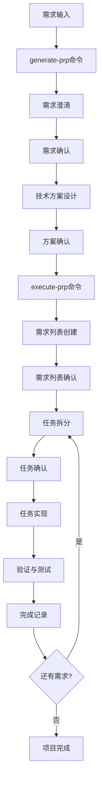

# EchoContent - 基于上下文工程的开发脚手架

## 🎯 项目概述

EchoContent 是一个基于上下文工程的基础工程脚手架，旨在通过标准化的开发流程和严格的质量控制，实现高效、可靠的软件项目开发。

## 🏗️ 项目架构

### 核心理念
- **PRP驱动开发**: 通过项目需求文档(Project Requirements Document)指导整个开发流程
- **用户确认机制**: 在关键决策点确保需求理解的一致性
- **质量优先**: 严格的代码规范和测试要求
- **文档同步**: 代码实现与文档更新保持同步

### 开发流程



## 📁 项目结构

```
EchoContent/
├── .claude/
│   └── commands/
│       ├── generate-prp.md    # PRP生成命令
│       └── execute-prp.md     # PRP执行命令
├── PRPs/                      # 项目需求文档存储
│   ├── feature.md            # 功能需求文档
│   ├── feature-question.md   # 需求澄清记录
│   └── technical-design.md   # 技术设计方案
├── tests/                     # 测试文件目录
├── examples/                  # 示例代码目录
├── src/ or app/              # 源代码目录
├── TASK.md                   # 项目任务管理文档
├── TASK_TEMPLATE.md          # 任务文档模板
├── INITIAL.md                # 功能需求模板
├── CLAUDE.md                 # AI助手配置文档
└── README.md                 # 项目说明文档
```

## 🚀 快速开始

### 1. 环境准备

确保您的环境中已安装：
- Claude CLI
- Git (推荐)
- 对应编程语言的开发环境

### 2. 创建功能需求

使用 `INITIAL.md` 模板创建功能需求文件：

```bash
cp INITIAL.md my-feature.md
# 编辑 my-feature.md，填写您的功能需求
```

### 3. 生成PRP文档

```bash
/generate-prp my-feature.md
```

这将启动三步协作流程：
1. **需求澄清与理解** - AI助手会分析需求并提出澄清问题
2. **需求确认** - 确认需求文档的准确性
3. **技术方案设计** - 制定详细的技术实现方案

### 4. 执行开发

```bash
/execute-prp PRPs/technical-design.md
```

这将启动四阶段执行流程：
1. **初始化与需求列表创建** - 创建TASK.md和需求列表
2. **需求细化与任务拆分** - 将需求分解为具体任务
3. **任务执行与实现** - 逐步实现功能
4. **项目完成与最终验证** - 全面检查和最终提交

## 📋 开发规范

### 代码质量要求

#### 文件大小限制
- **动态语言** (Python, JavaScript, TypeScript): ≤ 300行/文件
- **静态语言** (Java, Go, Rust): ≤ 400行/文件
- **文件夹容量**: ≤ 8个文件/层

#### 编码原则
避免以下代码"坏味道"：
- **僵化 (Rigidity)**: 系统难以变更
- **冗余 (Redundancy)**: 重复的代码逻辑
- **循环依赖 (Circular Dependency)**: 模块间相互纠缠
- **脆弱性 (Fragility)**: 修改导致意外损坏
- **晦涩性 (Obscurity)**: 代码意图不明
- **数据泥团 (Data Clump)**: 应组合的数据项分散
- **不必要的复杂性 (Needless Complexity)**: 过度设计

### 测试规范

- **测试框架**: 使用 Pytest 进行单元测试
- **测试覆盖**: 每个新特性必须包含测试
- **测试场景**: 至少包含正常、边界、失败三种场景
- **测试结构**: 测试文件与主应用结构保持镜像对应

### 文档要求

- **代码注释**: 为非显而易见的代码添加注释
- **内联注释**: 使用 `# Reason:` 解释设计原因
- **文档同步**: 功能变更后及时更新相关文档

## 🔧 命令详解

### /generate-prp

**用途**: 创建项目需求文档(PRP)

**语法**: `/generate-prp <功能描述文件路径>`

**流程**:
1. 需求澄清与理解
2. 需求确认
3. 技术方案设计

### /execute-prp

**用途**: 执行PRP文档

**语法**: `/execute-prp <PRP文件路径>`

**流程**:
1. 初始化与需求列表创建
2. 需求细化与任务拆分
3. 任务执行与实现
4. 项目完成与最终验证

## 📊 任务管理

### TASK.md 文档结构

```markdown
# 项目任务管理文档

## 📋 需求列表 (已确认)
- [x] 需求1：用户认证系统 - [已完成]
- [ ] 需求2：数据可视化模块 - [进行中]

## 🎯 任务清单 (需求2: 数据可视化模块)
### 任务2.1: 数据采集模块
- [x] 设计数据采集接口 - [已完成] 2025-11-02 15:30
- [ ] 数据清洗和预处理 - [进行中]

## 🔍 实现过程记录
- 2025-11-02 15:30 - 完成数据采集接口设计

## ✅ 项目完成状态
总体进度: 30% (1/3 需求已完成)
```

### 优先级定义

- **P0 (最高)**: 阻塞性任务
- **P1 (高)**: 核心功能任务
- **P2 (中)**: 重要但非紧急任务
- **P3 (低)**: 优化类任务

## 📝 Git工作流

如果项目使用Git版本控制，请遵循以下规范：

### Commit信息格式

```
<type>: <subject>

<body>

<footer>
```

**类型说明**:
- `feat`: 新功能
- `fix`: 修复bug
- `docs`: 文档更新
- `style`: 代码格式调整
- `refactor`: 代码重构
- `test`: 测试相关
- `chore`: 构建过程或辅助工具的变动

**示例**:
```
feat: 添加用户认证功能

- 实现用户注册和登录接口
- 添加JWT token验证机制
- 完善密码加密存储
- 更新相关API文档

Closes #1
```

## 🤝 协作模式

### AI助手角色

- **身份**: 资深技术专家和架构师
- **职责**: 提供专业、严谨、高质量的技术支持
- **原则**: 主动性、严谨性、高质量

### 用户职责

- **需求澄清**: 及时响应AI助手的需求澄清问题
- **方案确认**: 仔细审查技术方案并提供反馈
- **进度确认**: 对每个阶段的完成情况进行确认
- **质量把关**: 对代码质量和实现效果进行最终检查

## 📚 参考资源

- [Claude CLI 文档](https://docs.anthropic.com/claude/docs/claude-code)
- [项目最佳实践指南](docs/best-practices.md)
- [代码规范手册](docs/coding-standards.md)

## 🐛 问题反馈

如果在使用过程中遇到问题，请：

1. 检查本文档的相关章节
2. 查看 `.claude/commands/` 目录下的命令文档
3. 在项目issue中提出问题

## 📄 许可证

本项目采用 MIT 许可证 - 查看 [LICENSE](LICENSE) 文件了解详情。

---

**项目维护者**: 用户 + AI助手协作
**最后更新**: 2025-11-02
**版本**: 1.0.0